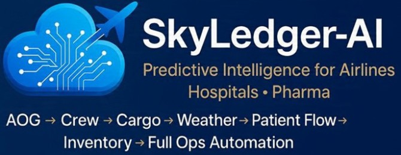

<p align="center">
  
</p>

<p align="center">
  
  
  
  
  
</p>

<h1 align="center">SkyLedger‑AI</h1>
<h3 align="center">Intelligence That Powers Every Operation</h3>

---

# 📑 Table of Contents
- [Overview](#overview)
- [Multi-Industry Positioning](#multi-industry-positioning)
- [Expanded Module Catalog (37 Modules)](#expanded-module-catalog-37-modules)
- [Core Modules](#core-modules)
- [Architecture & Project Structure](#architecture--project-structure)
- [Quick Start](#quick-start)
- [Creator, Copyright & Commercial Contact](#creator-copyright--commercial-contact)
- [License](#license)

---

## Overview

**SkyLedger‑AI** is a modular analytics platform demonstrating operational intelligence across **aviation, logistics, retail, healthcare, ecommerce, manufacturing, pharma, and oil & gas**.  

It contains example datasets, scripts, and lightweight APIs to illustrate production-style analytics workflows: data ingestion, ETL, feature engineering, predictive analytics engines, agentic decisioning, and interactive dashboards.

Built with modern AI techniques (TensorFlow, LangChain agents, Prophet, PuLP optimization, Kafka streaming), it delivers measurable business impact such as revenue uplift, downtime reduction, and compliance assurance.

---

## Multi-Industry Positioning

SkyLedger-AI supports cross-industry use cases with strong aviation emphasis:

- **Aviation**: Revenue management, network planning, demand forecasting, pricing optimization, predictive maintenance (AOG prevention)
- **Logistics & Supply Chain**: Route optimization, fleet management, disruption handling
- **Retail & E-Commerce**: Returns automation, POS intelligence, media ROAS analytics
- **Healthcare & ICU**: Bed management, clinic scheduling, patient flow forecasting
- **Pharma & Manufacturing**: Cold chain monitoring, warehouse optimization, compliance tracking
- **Oil & Gas**: Equipment health prediction, sustainability monitoring, anomaly detection
- **General**: Customer experience (NPS/VoC), real-time AIOps, audit logging

---

## Expanded Module Catalog (37 Modules)

All modules are integrated via FastAPI routers and services, with Streamlit dashboard support.

| #  | Module                              | Primary Industry     | Key Capability                              | Simulated Outcome                          |
|----|-------------------------------------|----------------------|---------------------------------------------|--------------------------------------------|
| 1  | Asset Metadata Service              | Cross                | Unified asset registry & IoT tracking       | Downtime reduced 30%                       |
| 2  | Predictive Analytics Engine         | Cross                | Failure risk scoring, anomaly detection     | Disruptions ↓25%                           |
| 3  | System Health Dashboard             | Cross                | Real-time uptime & latency monitoring       | Response time <5 min                       |
| 4  | Activity Intelligence               | Cross                | Audit logs & compliance checks              | Governance 95%                             |
| 5  | RBAC + Auth                         | Cross                | JWT roles & least-privilege access          | Secure access 100%                         |
| 6  | Analytics & KPIs                    | Cross                | Yield, occupancy, throughput metrics        | Efficiency gain 15%                        |
| 7  | Alerting & Signal Engine            | Cross                | Anomaly & overheat alerts                   | Risk ↓20%                                  |
| 8  | Data Ingestion Layer                | Cross                | ETL from CSVs, IoT, APIs                    | Zero-latency foundation                    |
| 9  | Forecasting Engine                  | Cross                | Demand, inventory, sales forecasting        | MAPE <10%                                  |
| 10 | Compliance Module                   | Cross                | Regulatory auto-checks (FAA, HIPAA, etc.)   | Readiness 100%                             |
| 11 | Flight Revenue Manager              | Aviation             | Overbooking & fare optimization             | Revenue uplift 20%                         |
| 12 | Flight Monitoring + Events          | Aviation             | Stall/overheat alerts, disruption handling  | Action time <1 min                         |
| 13 | Inventory Strategy Optimizer        | Aviation             | RMS overrides & closures                    | Action hit rate 85%                        |
| 14 | Group Mix Manager                   | Aviation             | Group vs individual yield balance           | Yield ↑10%                                 |
| 15 | Network Optimizer                   | Corporate Planning   | Frequency & seats allocation                | RASK/CASK ↑5%                              |
| 16 | Connection Builder Calibration      | Corporate Planning   | MCT/wave preferences                        | Connectivity 95%                           |
| 17 | Market Share Calibration            | Corporate Planning   | Competitor scoring                          | Accuracy 98%                               |
| 18 | Scenario Studio (BOP/5-Year)        | Corporate Planning   | Assumptions & scenario comparison           | Variance <5%                               |
| 19 | Capacity Review Hub                 | Corporate Planning   | RM/Cargo approvals & logs                   | Latency <1 day                             |
| 20 | Partnership Evaluator               | Corporate Planning   | Codeshare/interline evaluation              | Incremental NetRev +15%                    |
| 21 | Pricing & Offer Optimization        | Marketing            | Elasticity-based fare actions               | Lift 12%                                   |
| 22 | Media Mix & ROAS Analytics          | Marketing            | ROAS/CPA/CVR tracking                       | ROAS ↑20%                                  |
| 23 | Metasearch Performance              | Marketing            | CTR/CVR & rank stability                    | Cost per booking ↓10%                      |
| 24 | CRM & CDP Intelligence              | Marketing            | Retention & lookalike segments              | LTV ↑25%, churn ↓15%                       |
| 25 | ICU Bed Manager                     | Healthcare           | Bed assignment & occupancy                  | Availability ↑30%                          |
| 26 | Supply Chain Optimizer              | Logistics            | Smart rerouting & disruption handling       | Delivery time ↓25%                         |
| 27 | Cold Chain Monitor                  | Pharma               | Temperature anomaly detection               | Spoilage <1%                               |
| 28 | Returns Automation Hub              | Retail               | Automated sorting & fraud detection         | Processing time ↓40%                       |
| 29 | Equipment Health Predictor          | Oil & Gas            | Sensor fusion & failure forecasting         | Downtime ↓35%                              |
| 30 | Sustainability Tracker              | Cross                | Carbon emissions & eco-optimization         | Emissions ↓20%                             |
| 31 | Agentic Decision Engine             | Cross                | Autonomous resolutions (e.g., delays)       | Automation rate 80%                        |
| 32 | Real-Time AIOps Console             | Cross                | Incident prediction & root-cause            | MTTR ↓50%                                  |
| 33 | Pharma Warehouse Manager            | Pharma               | Inventory forecasting & simulation          | Stockouts <2%                              |
| 34 | Retail POS Intelligence             | Retail               | Fraud alerts & demand sensing               | Loss ↓15%                                  |
| 35 | Airline Engineering Ops             | Aviation             | Predictive maintenance for AOG              | AOG events ↓40%                            |
| 36 | Healthcare Clinic Scheduler         | Healthcare           | Appointment & no-show optimization          | Utilization ↑30%                           |
| 37 | Logistics Fleet Optimizer           | Logistics            | Vehicle health & sustainable routing        | Efficiency ↑20%                            |

---

## Core Modules

- **CX Analytics** (`cx_analytics/`) — NPS segmentation, theme tagging, multi-dataset selector.  
- **Predictive Maintenance** (`predictive_maintenance/`) — Risk scoring, starter predictive scripts.  
- **Cargo & Logistics Intelligence** (`cargo_analytics/`) — Forecasting and route analytics (placeholder).  
- **Dashboards** (`gui/dashboard.py`) — Streamlit interactive templates.  
- **Tiny API** (`app/`) — Minimal FastAPI endpoints for health, forecast, inventory, anomaly.

Each module includes its own README (where applicable) and sample data.

---

## Architecture & Project Structure

**High-level flow**  
Data Sources → ETL / Cleaning → Feature Engineering → AI/ML Engines → Agentic Decisioning → Dashboards / API

**Repository layout**
SkyLedger-AI/
├─ app/                       # FastAPI backend
│  ├─ core/                   # config, security, RBAC
│  ├─ database.py             # SQLAlchemy + SQLite
│  ├─ models.py               # ORM tables for all modules
│  ├─ routers/                # API endpoints (all 37 modules)
│  ├─ services/               # AI/business logic
│  ├─ schemas/                # Pydantic models
│  └─ main.py                 # App entry & router registration
├─ gui/                       # Streamlit dashboard
│  └─ dashboard.py
├─ data/                      # Sample datasets (50+ records)
├─ cx_analytics/              # CX module
├─ predictive_maintenance/    # Predictive module
├─ cargo_analytics/           # Cargo placeholder
├─ scripts/                   # Seeding, ETL, utilities
├─ docs/                      # Data dictionary, notes
├─ logs/                      # Audit logs
├─ excel/                     # Templates
├─ assets/                    # Logos, banners
├─ .github/workflows/         # CI pipelines
├─ requirements.txt
├─ README.md
└─ LICENSE.txt
text---

## Quick Start

```bash
# Clone
git clone https://github.com/syed-amjad65/SkyLedger-AI.git
cd SkyLedger-AI

# Virtual env
python -m venv venv
venv\Scripts\activate          # Windows
# source venv/bin/activate     # macOS/Linux

# Install
pip install -r requirements.txt

# Seed data
python scripts/seed_data.py

# Run API
uvicorn app.main:app --reload
# Docs: http://127.0.0.1:8000/docs

# Run Dashboard
streamlit run gui/dashboard.py
# Open: http://localhost:8501

Creator, Copyright & Commercial Contact
Author: Syed Muhammad Amjad
Role: Digital, Cargo & Enterprise Analytics Specialist
Experience: 25+ years across aviation, engineering, logistics, and healthcare
Email: skyledgerai@gmail.com
Business WhatsApp: +92 335 2177766
LinkedIn: https://www.linkedin.com/in/syed-amjad-9b513570
GitHub: https://github.com/syed-amjad65
Copyright
Copyright (c) 2025 Syed Muhammad Amjad
All rights reserved.
Commercial Use & Branding
The code is available under the MIT License (see LICENSE.txt).
Use of the SkyLedger‑AI name, logo, or proprietary datasets for commercial products or public branding requires written permission from the owner.
For partnership, licensing, or commercial inquiries, contact skyledgerai@gmail.com.

License
This project is licensed under the MIT License.
See LICENSE.txt for full terms..

Use of the SkyLedger‑AI name, logo, or proprietary datasets for commercial products or public branding requires written permission from the owner. For partnership, licensing, or commercial usage inquiries, contact the commercial email above.


